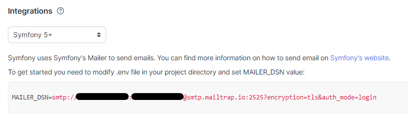

## Rappel du projet

- [Présentation](docs/présentation%20locauto.docx)
- [Pas à pas (incomplet)](docs/project%20pas-à-pas.docx)

## Installation

1. Cloner le projet.  
2. `composer install`
3. `yarn`

## Utilisation

1. `symfony serve`
2. `yarn watch`
3. Vous pouvez utiliser [mailtrap](https://mailtrap.io/register/signup?ref=header) pour recevoir les mails d'enregistrement de compte ou de mot de passe oublié, etc ... Une fois le compte `mailtrap` créé, il vous faudra mettre les données de connexion dans la clé `MAILER_DSN` dans le fichier `.env.local` :
   
4. Avec les fixtures, accès en `admin` : Tom / TestPasswordAdmin123%
5. Avec les fixtures, accès en `user` : Yolo / TestPasswordUser123%

## Tests

Voir la doc de Testcafe : le [getting started](https://testcafe.io/documentation/402635/getting-started) et [tous les guides](https://testcafe.io/documentation/402634/guides)  

Sur Windows, il faut installer `make` : `choco install make`

Si vous n'avez pas `chocolatey` : <https://chocolatey.org/install>

Une fois `make` installé, vous avez accès aux commandes suivantes :  

- `make setuptest` :
  
  - supprime la BDD de l'environnement de test, si elle existe;  
  - la réinstalle, vide;  
  - la remplit avec les fixtures :  

- `make test` :
  - `testcafe chrome tests/testcafe --skip-js-errors --debug-on-fail` : lance les tests avec Testcafe

## Notes

Plusieurs difficultés étaient dissimulées dans ce projet :

- le type `Enum` à mettre en place sur l'entité `Member`;
- utiliser SQL (ou DQL comme ce que j'ai utilisé) pour filtrer correctement la liste des véhicules disponibles entre une date de départ et une date de fin;
- combiner ce filtre avec la création d'une commande de véhicule (les `<input type="hidden">` dans le template de prise de commande);
- mettre en place un champ de formulaire personnalisé ainsi que du javascript pour avoir un rendu des photos des véhicules sur les formulaires concernés;
- mettre en place du javascript pour avoir un rendu de ces photos lors de la modification d'une commande en tant qu'admin;

A moins d'être un développeur expérimenté et éventuellement avoir déjà codé ce genre de feature, il ne faut pas espérer terminer en 3 jours tout en respectant la demande. Le projet n'est clairement pas étudié en ce sens. Personnellement, j'ai dû faire beaucoup de recherches pour arriver à ce résultat, et j'ai très (trop !) longtemps bloqué sur la requête de filtre des véhicules disponibles. La solution était de décomposer avec une sous-requête. En programmation, le fait de décomposer les choses solutionne souvent les problèmes.
